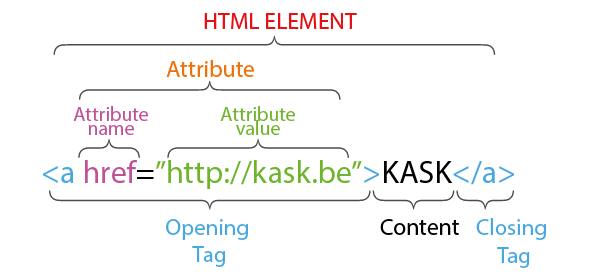

<details>
<summary>Table of Contents - click to expand!</summary>

- [HTML elements, tags and attributes](#html-elements-tags-and-attributes)
	- [Elements and tags](#elements-and-tags)
	- [Attributes](#attributes)
- [Looking at the HTML of a website](#looking-at-the-html-of-a-website)
- [Hierarchical relations between elements](#hierarchical-relations-between-elements)
- [Whitespace in HTML documents](#whitespace-in-html-documents)
- [Organizing files](#organizing-files)
- [Rules for filenames](#rules-for-filenames)
- [URL's](#urls)
	- [Absolute URL's:](#absolute-urls)
	- [Relative URL's:](#relative-urls)
- [Basic structure of an HTML document](#basic-structure-of-an-html-document)
	- [Doctype](#doctype)
	- [`<html>`](#html)
	- [`<head>`](#head)
	- [`<body>`](#body)
- [How to check if your HTML is correct?](#how-to-check-if-your-html-is-correct)
- [Commonly used HTML elements](#commonly-used-html-elements)
	- [Inline vs block-level elements](#inline-vs-block-level-elements)
	- [Headings](#headings)
	- [Paragraphs and breaks](#paragraphs-and-breaks)
	- [Text formatting](#text-formatting)
	- [Comments](#comments)
	- [Lists](#lists)
	- [Links](#links)
	- [Images](#images)
	- [Videos](#videos)
	- [Sounds](#sounds)
	- [Tables](#tables)
	- [Structural elements](#structural-elements)
	- [Entities](#entities)
- [Exercise: turn some content into a website](#exercise-turn-some-content-into-a-website)
- [Homework](#homework)
</details>

# HTML

- or Hypertext Markup Language
- meaning and structure: paragraphs, lists, tables, links, ...
- hypertext: links connect pages
- markup: syntax to give meaning to content

## HTML elements, tags and attributes



### Elements and tags

- HTML elements are the building blocks of HTML pages.
- `<p>`, `<h1>, `<table>`, ...
- +-100 different elements  

Start and end tags:    
- An element usually has a start and end tag, an opening and closing tag.
- For example: `<p>` and `</p>`.
- A start (= opening) tag starts with `<` and ends with `>`.  
- An end (= closing) tag starts with `</` and ends with `>`.
- Not all tags have closing tags. For example: `<br>`, a break, or a new line. Another example: ``.    

Tag names:
- Tags have names, for example the name of the `<p>` tag is `p`.
- The names are not case-sensitive, but lowercase is more common.

[Overview of all HTML tags](https://developer.mozilla.org/en-US/docs/Web/HTML/Element)


### Attributes

- Some elements have attributes.
- Attributes are used to add extra info to an element.
- For example: ``. The `` element requires a `src` (source) attribute to let the browser know which image to load.
- Attribute always have the form `name="value"`.
- Attributes always appear at the start tag, never at the end tag.
- Some attributes are required, while others are optional. For example: the `src` attribute is required for an `` tag. The `width` attribute for an `` is optional.
- An element can have multiple attributes, separated by a space. The order is not important. For example: ``.

[Overview of all HTML attributes](https://developer.mozilla.org/en-US/docs/Web/HTML/Attributes)

## Looking at the HTML of a website

You can look at the HTML of any page and see how it's made:

- In most browsers, you can right-click on an element, and then select 'Inspect element'. A panel will open and show you the source of that element.
- You can see the entire HTML source of a webpage by right-clicking on the page in your browser, and then select 'View page source' or shortcut **ctrl/cmd + u**

## Hierarchical relations between elements

Elements can contain other elements. For example:

```html
<p>This is some text, and this is in <strong>bold</strong>.</p>
```

The nesting can go deeper:

```html
<p>This is some text, and this is in <strong><em>bold and in italics</em></strong>.</p>
```

We can also reformat this to show the hierarchy more clearly:

```html
<p>
    This is some text, and this is in
        <strong>
            <em>
                bold and in italics
            </em>
        </strong>
    .
</p>
```

Now it's more clear that there are 3 levels in piece of HTML, with a hierarchy between them. This will be important later when we talk about CSS.

There are rules about which sub-elements an element can contain. For example, a `<p>` can contain `<strong>` and `<em>` elements, but not a `<table>` element.

Elements must also be properly nested. This is wrong for example:

```html
<strong><em>bold and in italics</strong></em>
```

The element that is opened last has to be closed first.

Browser are very forgiving. If you make a mistake, they will try to guess what you meant. In many cases, your page might work even if it contains errors. However, you should always avoid these situations, because it will lead to frustration and confusion when you start applying CSS and JS.

## Whitespace in HTML documents

- Whitespace = spaces, tabs, line break (new line).
- Browser ignore almost all whitespace.

For example:

```
<p>Hello world!</p>
```

Renders exactly the same as

```
<p>


Hello                       world!
                </p>
```

Use whitespace to make the hierarchy clear between the elements. It makes the code more readable, and there is less chance of mistakes.

For example:

```html
<table><tr><td>Item 1</td><td>€5</td><td>3</td></tr><tr><td>Item 2</td><td>€7</td><td>11</td></tr></table>
```

This is correct HTML but it's not very readable. It can be rewritten as:

```html
<table>
    <tr>
        <td>Item 1</td>
        <td>€5</td>
        <td>3</td>
    </tr>
    <tr>
        <td>Item 2</td>
        <td>€7</td>
        <td>11</td>
    </tr>
</table>
```

The result in the browser will be exactly the same, but the code is much more readable.

This piece of HTML has 3 levels. Each level is indented with a specific number of tabs. It's easy to see where an element belongs inside the structure by looking at the number of tabs in front of each element.

- level 0: `<table>`, 0 tabs
- level 1: `<tr>` inside `<table>`, 1 tab
- level 2: `<td>` inside `<tr>`, 2 tabs

Using indentation (tabs or spaces) is not required, but it helps a lot.

## Organizing files

No fixed rules. Typical directory structure of a website:

- `index.html` -> the home page
- `another_page.html`
- `img/` -> directory with images used on the site
- `css/` -> directory with stylesheets
- `js/` -> directory with JavaScript files

## Rules for filenames

HTML documents typically use the extension `.html` or `.htm`

The following rules apply to HTML documents, and other files, like images, css, js, ...:
- It's best to avoid spaces in filenames. Use a dash `-` or an underscore `_` instead. Spaces are not allowed in URL's.
- Use lowercase for filenames. The server of your site might be case-sensitive, meaning: `Index.html` and `index.html` are two different documents. This could mean that your site works on your computer, but that links and images are broken when you put it online. Avoid confusion by using lowercase everywhere.

## URL's

URL's are used for links, images, ...    
A URL can **absolute** or **relative**.

### Absolute URL's:

- For example: `https://google.be`, `https://kask.be/img/logo.png`, `http://mysite.com/js/script.js`, ...
- Start with `http://` or `https://`.
- But do not use URL's starting with `file:///` as this only works on your computer.
- Use them only to link to pages and files outside your own website.


### Relative URL's:

- For example: `about_us.html`, `img/logo.png`, `/`, `../data/projects.json`, ...
- Don't start with http:// or with https://.
- They only work in a specific place - they are relative to a document. If you move the document to another directory, the links won't work anymore.
- Advantage: relative URL's are shorter and more flexible. E.g. if you change the domain name of your site, you don't have to change the relative URL's.
- Disadvantage: if you move a page or file, you have to update all the links pointing to that page or file.    

You need to include the path to the file you want. For example, suppose you have the following directory structure:

- `index.html`
- `img/`
    - `img/logo.png`

If you want to include `logo.png` in `index.html`, you would use the URL `img/logo.png`.

You can use `..` to step 'one directory up'. For example, suppose you have this directory structure:

- `index.html`
- `projects/`
    - `project_one.html`

If you want to link from `project_one.html` to `index.html`, you use the URL `../index.html`.

You can repeat `..` as many times as necessary, for example: `../../../my_page.html`.

## Basic structure of an HTML document

This is a minimal HTML page:

```html
<!DOCTYPE html>     
<html lang="en">
    <head>
        <meta charset="utf-8">
        <title>This is the title</title>
    </head>
    <body>
        <h1>Hello world!</h1>
    </body>
</html>
```

### Doctype

- Necessary, but no need to worry about the details.
- Must be on the first line.
- Mostly needed for historical reasons. There are different versions of HTML. By using this `DOCTYPE`, we tell the browser we want to use HTML 5.

### `<html>`

- An HTML document contains HTML elements.
- The `<html>` element is the container for the whole page.
- There is a hierarchical relationship between the elements.
- The `<html>` element is at the top of hierarchy.
- It has two child elements: `<head>` and `<body>`.
- These are required. In other parts of the document you are free to include other elements, but inside `<html>` we need to use `<head>` and `<body>`.
- Always set the `lang` attribute of the `<html>` element so search engines and other software know what language your document is in.

### `<head>`

- The `<head>` element contains meta information, meaning info about the document itself.
- Most important: the `<title>` of the document.
- The title appears in the title bar of the browser window, and is used when you save a bookmark, or save the page.
- It's also very important for search engines. The title is used in the search results. Also, search engine will use the text of the `<title>` to rank search results. It's very important for SEO to give good titles to pages, and to make them unique.
- `<meta charset="utf-8">` means: use the UTF-8 character set, which allows you to use characters from most languages (including Cyrillic, Japanese, ...)
- Other things that can appear in the `<head>` element: references to stylesheets, a favicon, ...

### `<body>`

- The `<body>` element contains the actual content: text, images, ...

## How to check if your HTML is correct?

- You can 'validate' your document = checking if the HTML is correct.
- Go to https://validator.w3.org.
- Click on the tab 'Validate by Direct Input'.
- Copy and paste the HTML and click 'Check'.
- Read the results and fix any errors.

## Commonly used HTML elements

### Inline vs block-level elements

HTML elements can be divided in 2 groups: block-level and inline.

Block-level elements:

- examples: `<p>`, `<h1>`, `<table>`, ...
- begin on a new line
- take up the full width of their parent element    

Inline elements:

- examples: `<strong>`, `<em>`, ``, ...
- can be part of a line of text
- do no start a new line

### Headings

- `<h1>`, `<h2>`, `<h3>`, `<h4>`, `<h5>`, `<h6>`
- Are block-level elements.
- `<h1>` = most important title
- `<h2>` = subtitle
- Use headings to indicate the logical levels in your text.

### Paragraphs and breaks

- `<p>This is a paragraph.<p>`
- Are block level elements.
- Use a break `<br>` to create a new line in a paragraph.

### Text formatting

- `<strong>`: bold
- `<em>`: italic
- `<hr>`: horizontal rule

### Comments

- `<!-- some comment  -->`
- Never shown by the browser.
- You can use this to clarify the structure of your document.
- Useful to temporarily hide something while working on a page.

### Lists

- Very common. Also used for navigation items.
- Can be ordered (with a numbering) and unordered (no numbering).
- Are block level elements.

Ordered:

```html
<ol>
    <li>cookies</li>
    <li>milk</li>
    <li>bread</li>
</ol>
```

Unordered:

```html
<ul>
    <li>cookies</li>
    <li>milk</li>
    <li>bread</li>
</ul>
```

Lists can also be nested:

```html
<ol>
  <li>
    item 1
    <ol>
      <li>item 1a</li>
      <li>item 1b</li>
    </ol>
  </li>
  <li>item 2</li>
</ol>
```

### Links

- `<a href="path_to_link">content that is a link</a>`
- `<a>` stands for 'anchor'
- The `href` ('hypertext reference') attribute is required.
- Use relative paths for linking files within your website and absolute paths to link to external resources and websites.
- `<a href="path_to_link" target="_blank">` The attribute `target="_blank"` is used to open the link in a new tab or page.
- Are inline level elements, so you can place a link within paragraphs, headers, lists, ...

Example of a simple link:

```html
Read more <a href="about_us.html">about us</a>.
```

Link to an external page that opens in a new window or tab:

```html
Our school <a href="https://kask.be" target="_blank">KASK</a>.
```

Linking an image:

```html
<a href="index.html">
    
</a>
```

Email links:

- `<a href="mailto:info@kask.be">send me a mail</a>`
- Clicking on the link will open a mail client (Outlook, Thunderbird, Apple Mail, ...)


### Images

``
- The `src` attribute is required.
- Use relative paths for loading images within your website and absolute paths to link to an image on another website.
- `alt` attribute: a textual description of the image. This is very important to make your website accessible to anyone, including the visually impaired. A screen reader will read out the value of this attribute. It can also be used by search engines.
- You can omit the description within the `alt` attribute if the image you are using is decorative and has no 'real meaning', for example a drop shadow, a separator, ...
- Are inline level elements.
- Browsers support GIF, JPEG, PNG and SVG (vector image). You will need to convert other file formats to a supported format first, or the browser will not show it.

### Videos

```html
<video src="videos/kitten.mp4" controls autoplay>
	Sorry, your browser doesn't support embedded videos.
</video>
```
- Similar as the `` element a path to the video file is included with a `src` attribute.
- Possible attributes: `width` and `height`, `autoplay` and `loop`, etc.
- The text inside the opening and closing `<video>` `</video>` tags is shown as a fallback for browsers that don't support video.
- The common video containers used on the web are MP4, Ogg/Ovg & WebM.

### Sounds

```html
<audio src="sounds/miauw.mp3" controls autoplay loop>
	Your browser does not support the audio.
</audio>
```
- Again similar as `` and `<video>`
- If the attribute controls is false we don't see anything in the page.
- The most common codec is MP3 but others as WAV and vobis will also work.

### Tables

Example:

```html
<table>
    <tr>
        <td>
            Row 1, column 1
        </td>
        <td>
            Row 1, column 2
        </td>
        <td>
            Row 1, column 3
        </td>
    </tr>
    <tr>
        <td>
            Row 2, column 1
        </td>
        <td>
            Row 2, column 2
        </td>
        <td>
            Row 2, column 3
        </td>
    </tr>
</table>
```

- Under the `<table>` element, create a `<tr>` for each row. `tr` = table row.
- Inside each `<tr>`, create a `<td>` element. `td` = table data.
- For the column titles, you can use a `<th>` instead of a `<td>`. `th` = table heading.

### Structural elements

These can help structuring your document but are not necessary. Some have a specific role and others have not.    

**The right element for the right job**    

- `<header>`: a block-level element at the top part of the page, which usually contains the main navigation, a logo, a tagline, ...  Not to be confused with the `<head>` element.
- `<footer>`: a block-level element at the bottom part of the page, which usually contains copyright info, links to social media, legal disclaimers, ...
- `<nav>`: a block-level element that contains the navigation.
- `<main>`: a block-level element with the actual content of the page. Used only once per page.
- `<article>`: a block-level element that represents a independent item section of content. Examples are: a forum post, a magazine or newspaper article, a blog entry.
- `<section>`: a block-level element that groups thematic related content as chapters, .

**The non-semantic wrappers**    

- `<div>`: a block-level element used to define a part of a web page. The above elements are nowadays more in use as they tell more about the content. 
- `<span>`: an inline element used to define a part of a web page.


```html
<!DOCTYPE html>     
<html lang="en">
    <head>
        <meta charset="utf-8">
        <title>This is the title</title>
    </head>
    <body>
        <header>
        <!-- logo, tagline, ... -->
	<nav>
	<!-- navigation -->
	</nav>
        </header>
        <main>
        <!-- the actual content of a page -->
	<section>
	<!-- grouped content -->
	</section>
        </main>
        <footer>
        <!-- credits, copyright info, ... -->
        </footer>
    </body>
</html>
```

### Entities

- Or **Escape characters** are characters that are used in and reserved by HTML code.
- For example `<` is the start of the tag.
- We cannot use these characters directly because we would confuse the browser. We need to use 'entities'. (They need to be 'escaped'.)

Common entities:

- `&gt;` for `>` (`gt` stands for greater than)
- `&lt;` for `<` (`lt` stands for lesser than)
- `&amp;` for `&` (`amp` stands for ampersand)

## Exercise: turn some content into a website

- In this exercise you will create a website based on one of the projects you are currently working on.
- Create a new folder for this. Create the necessary files and directories. All media files (images) should be in a separate folder.
- Each page should have a navigation, with links to the homepage and the other pages. 
- Each page should also have a footer.
- One of the pages is an about-page containing a short textual explanation of the work. If you don't have a text yet, you may use dummy text.
- Use images and eventually video or audio.
- Make sure your media files are not too big. Limit the resolution (max. 2500pixels wide) and therefore the file size (max. 1Mb) for photos. 10 to 20Mb for video should be doable.
- Remember: we work with HTML only now, and HTML is for structure, not for layout or design. For the moment it's OK if you can not position and style things as you would. 
- Use proper indentation (tabs) so your code is readable.
- Validate both HTML pages using https://validator.w3.org. There should be no errors.

## Homework

- HTML review: https://www.w3schools.com/html/default.asp
- HTML quiz: https://www.w3schools.com/quiztest/quiztest.asp?qtest=HTML
- Read through https://www.w3schools.com/css/default.asp
