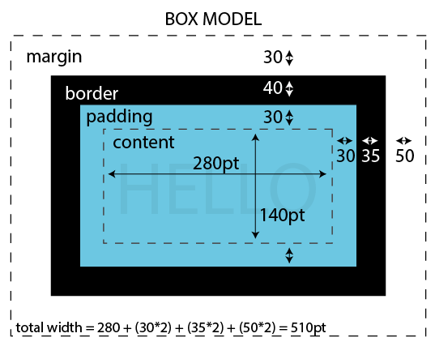

<details>
<summary>Table of Contents - click to expand!</summary>

- [What can you do with CSS?](#what-can-you-do-with-css)
- [CSS files](#css-files)
- [Rules](#rules)
- [Browser default stylesheet](#browser-default-stylesheet)
- [Selectors](#selectors)
	- [Type selectors](#type-selectors)
	- [Inheritance](#inheritance)
	- [Grouping selectors](#grouping-selectors)
	- [Selecting elements inside other elements](#selecting-elements-inside-other-elements)
	- [Class selectos](#class-selectors)
	- [Id selectors](#id-selectors)
	- [Pseudo-class selectors](#pseudo-class-selectors)
	- [The most specific rule wins](#the-most-specific-rule-wins)
	- [`<div>` and `<span>`](#div-and-span)
- [Applying CSS to HTML documents](#applying-css-to-html-documents)
	- [External stylesheets](#external-stylesheets)
	- [Internal stylesheets](#internal-stylesheets)
	- [Inline styles](#inline-styles)
- [CSS syntax](#css-syntax)
	- [Defining colors](#defining-colors)
		- [Color names](#color-names)
		- [Hexadecimal values](#hexadecimal-values)
		- [RGB](#rgb)
	- [Property names](#property-names)
	- [Units](#units)
	- [Comments](#comments)
- [Commonly used properties](#commonly-used-properties)
	- [`color`](#color)
	- [`background-color`](#background-color)
	- [`background-image`](#background-image)
	- [`border`](#border)
	- [`margin` and `padding`](#margin-and-padding)
	- [Typography](#typography)
	- [Fonts](#fonts)
		- [Using commonly available fonts](#using-commonly-available-fonts)
		- [Using a font service](#using-a-font-service)
	- [Positioning](#positioning)
	- [Transitions](#transitions)
	- [Animations](#animations)
- [Exercise: styling a website](#exercise-styling-a-website)
</details>

# CSS

- Never use HTML for **presentation, formatting or design** :point_right: that's what CSS is for!
- CSS = Cascading Style Sheets
- CSS = rules defined by you that tell the browser how to display the elements in your HTML page.
- Very powerful, try [this example](https://www.w3schools.com/css/css_intro.asp). CSS can be used to transform an HTML document in many different forms.

## What can you do with CSS?

- Design: colors, background colors, space between elements, ...
- Typography: fonts, ...
- Positioning: columns, overlaying elements, ...

## CSS files

- Usually, CSS rules are placed in a separate files, commonly called 'stylesheets'.
- These files have the extension `.css`.
- You can choose the filename, but common names are `style.css` or `styles.css`.
- You need tell an HTML document which stylesheet to use by making a reference to the CSS file in the `<head>` of the document: `<link rel="stylesheet" href="css/styles.css">`

For example:

```html
<!DOCTYPE html>     
<html lang="en">
    <head>
        <meta charset="utf-8">
        <title>This is the title</title>
        <link rel="stylesheet" href="css/styles.css">
    </head>
    <body>
        <h1>Hello world</h1>
    </body>
</html>
```

- Usually you will have 1 stylesheet and connect that with a `<link>` element to the different pages of your site. This is powerful: you can control to look of the entire site (multiple pages) through 1 file.
- Yes, you can have multiple stylesheets connected to the same HTML document. But in most case you'll want to keep it simple: just 1 stylesheet.
- Sometimes there are good reasons to create multiple stylesheets. For example: one for display on screen, and one for when the page is printed (with different fonts, only grayscale to save ink, ...)

## Rules

So CSS files contain rules. A rule consists of:

- a selector
- a declaration block, with one or more declarations between curly braces

In general:

```css
selector {
    property: value;
    another-property: value;
}
```

- The *selector* determines to what part of the HTML document the rule will apply.
- The *declaration block* is list of one or more declarations.
- A *declaration* consists of the name of a property and value.
- *Properties* are things like colors, padding settings, fonts, ...
- The properties and values are separated with a *colon* (`:`). For example: `color: red`.
- Each property and value pair has to end with a *semicolon* (`;`).

For example:

```css
p {
    color: blue;
    background-color: red;
}
```

- The selector is `p`.
- The declaration block is everything between `{` and `}`.
- The are two declarations: `color: blue;` and `background-color: red;`. In the first one, the property is `color`, and the value is `blue`.

The order of the declarations does not matter. We could have listed `background-color` first and the result would have been the same.

### Exercise: linking a CSS file to an HTML document

- Create a new directory called `css-tutorial`.
- Create an HTML document in this directory. Name it `index.html`.
- Add a few paragraphs to the document.
- Create a directory inside stylesheet called `css`.
- Create a file called `style.css` inside the `css` directory.
- Connect the stylesheet to the HTML document.
- Use the stylesheet to color the paragraphs red.

## Browser default stylesheet

- Even if you don't add any rules at all to a page, the browser will still apply some CSS rules.
- Reason: the browser has a default stylesheet.
- It sets reasonable defaults: text is in black, background is white, links are underlined an in blue, an `<h1>` will be larger than a `<h2>`, ...
- You can override these with your own CSS.  

## Selectors

- Selectors: used to 'select' a part of the page. Selectors allow you to precisely define to what HTML the rules will apply.
- There are many different types of selectors. The system is very flexible.
- Understanding selectors is also important for JavaScript.
- In many cases, multiple rules can apply on an element. In that case, the most specific rule wins. This will become clear later.

### Type selectors

- Also called element or tag selectors.
- Easiest to understand and most common.
- Example: `p`, `h1`, `a`, ...
- These apply a rule to all elements with a specific tag name.
- Useful for defining the overall appearance of links, headers, paragraphs, ...

For example:

```css
p {
    color: blue;
}
```

This will make all paragraphs blue.

#### Exercise

- Add an `h1` and an `h2` to your `index.html`.
- Use CSS to make the `h1` blue, and the `h2` green.

### Inheritance

If you apply a property to an element, all the children of that element will also inherit that rule.

For example if you apply this CSS:

```css
body {
    color: blue;
}
```

To this HTML:

```html
...
<body>
   <p>Hello</p>
</body>
...
```

Then the paragraph will also be blue, because it is inside the `<body>` element.

Remember:

- HTML is like a tree structure, with hierarchical relations between elements (an element can contain other elements).
- The CSS you apply to a 'higher' element will also apply to the 'lower' elements.

Most CSS properties work like this: colors, fonts, ... But there are exceptions: for example margins.

#### Exercise

- Set the default color of your document to white.
- Set the default background color of your document to black.
- Test it out by adding a `<ul>` to the document. The text should be white.

### Grouping selectors

You can group selectors by using comma's. For example:

```css
p, h1, h2 {
    color: blue;
}
```

This will apply the rules in the declaration to all elements of the group. You can combine this with other rules. For example:

```css
p, h1, h2 {
    color: blue;
}

h1 {
    background-color: red;
}

h2 {
    background-color: yellow;
}
```

#### Exercise

- Change the default font to Arial. You can set the font like this: `font-family: Arial, sans-serif;`.
- Set the font of the headings to Courier: `font-family: Courier, monospace;`.

### Selecting elements inside other elements

Use a space to indicate that you want to select elements appearing inside other elements. For example, this will only affect links in paragraphs. The rule will not be applied to other links.

```css
p a {
    color: green;
}
```

#### Exercise

- Add 1 link (`<a href="...`) in a paragraph.
- Add another link in the `<ul>`.
- Change the default color of links to yellow.
- Set the color of links inside a paragraph to pink.

### Class selectors

- Tag selectors are useful, but in many cases you want to be more specific. For example, you want apply a rule only to some paragraphs, not to all.
- In this case you can use the **`class` attribute**. This attribute can be added to any HTML element. You can then reference it in your CSS.

For example, suppose you want to change the look of the first paragraph in this HTML:

```html
<p class="intro">
    This is the first paragraph.
</p>
<p>
    Another one.
</p>
<p>
    And another one.
</p>
```

Note that we added an attribute `class="intro"` to the first paragraph. This allows us to target it with CSS rules. For example, if we want to indent the first paragraph:

```css
.intro {
    text-indent: 70px;
}
```

You are free to choose the name of the class, but there are some rules:

- The name can only contain letters and digits.
- Spaces are not allowed inside class names. Spaces can be used to add multiple classes to the same element. For example: `class="intro centered-text"` gives the element 2 classes: intro, and centered-text.
- Use a dash `-` or and `_` to create word breaks inside a class name.

Once you added a `class` attribute, you can target it in the CSS by adding a period `.` in front of the name:

```css
.intro {
    color: green;
}
```

You can re-use the `class`, and do not only so with paragraphs. For example: `<h1 class="intro">` would also work.

Tag names and class names can be combined, for example:

```css
p.intro {
    color: green;
}
```

This means: apply the rule to `<p>` elements that have the class intro, but not to other elements, like headings.

### Id selectors

- Similar to the class selectors, but the value of an `id` attribute **can only appear once** in the page. (The same `class` can be used as much as you want in a document.)
- Less used than `class`, but you might see it.
- In CSS: use `#` before the name to target it.

Example:

```html
<h1 id="main-title">This is the main title</h1>
```

```css
#main-title {
    color: green;
}
```

#### Exercise

- Add a shopping list using a `<ul>`.
- Give it a class `shopping-list`.
- Make the font for the shopping list smaller using `font-size: 10px`.

### Pseudo-classes

- CSS has some pseudo-classes. They work like classes, but you can't define them yourself. The browser automatically makes them available for you.
- Pseudo-classes are prefixed with a colon `:` instead of a period.
- For now, the only one to remember is `:hover`. This pseudo-class is activated when you hover over an element with your mouse.

Example, change the color of a link when hovering over it:

```css
a:hover {
    color: green;
}
```

See [here](https://developer.mozilla.org/en-US/docs/Web/CSS/Pseudo-classes) for more pseudo-classes.


#### Exercise

Change the color of the links when hovering.


### The most specific rule wins

What happens when multiple rules can be applied to an element?

For example:

```html
<body>
    <h1>
        A title
    </h1>
    <p class="intro">
        This is the first paragraph.
    </p>
    <p>
        Another one.
    </p>
    <p>
        And another one.
    </p>
</body>
```

CSS:

```css
body {
    color: red;
}
p {
    color: blue;
}
p.intro {
    color: green;
}
```

What color will each element have?

- All elements are hierarchically inside the `<body>` elements, so they all will be red, unless there are more specific rules.
- There are no rules for the `<h1>` that are more specific, so it will be red.
- The `<p>` elements will be blue by default, because they have a rule that is more specific than the one for `<body>`.
- The first paragraph has an even more specific rule: a combination of the tag name and a class name. This is more specific than the general rule for paragraphs.

### `<div>` and `<span>`

- HTML elements are used to apply meaning to a document, for example: `<h1>` means 'important title'.
- There are 2 elements that don't have any meaning at all: `<div>` and `<span>`.
- A `<div>` is a block-level element. It starts on a new line.
- A `<span>` is a inline element. It does not start on a new line.
- These elements are tools to group content so that you can target them with CSS. You do this by adding `class` or `div` attributes.
- Remember the [Structural elements](02_html.md/structural-elements) chapter in HTML.

For example, let's say you want to have a border around a couple of paragraphs:

```html
<p>Paragraph 1</p>
<p>Paragraph 2</p>
```

There is not really a semantic way to group these together in HTML, so we could use a `<div>` to group them:

```html
<div class="important">
    <p>Paragraph 1</p>
    <p>Paragraph 2</p>
</div>
```

We added a `class` attribute, so we can do this in the CSS:

```css
.important {
    border: 1px solid black;
}
```

A `<span>` is similar, but it works inline. For example:

```html
<p><span class="web-technology">HTML</span> and <span class="web-technology">CSS</span> are really cool.</p>
```

```css
.web-technology {
    font-size: 20px;
}
```

### Exercises

- Add a footer to your page using a `<div>` and a `class`.
- Of course you can also use the semantic tags `<footer>` for a footer <div>
- Add your name in the footer.
- Make the text in the footer smaller.

### More exercises

https://www.w3schools.com/css/css_selectors.asp

## Applying CSS to HTML documents

3 different ways to apply CSS to HTML:

1. External stylesheets
2. Internal stylesheets
3. Inline CSS

### External stylesheets

- This is what we used so far.
- This is the most common and most useful way of working.
- The CSS rules are in an external, separate document.
- The external document is linked to the HTML document with a `<link>` element in the `<head>`.

### Internal stylesheets

- The rules are inside a `<style>` element in the `<head>`.
- Less useful, because can only be used for 1 document.
- Best to avoid if possible. OK if you have a couple of rules that apply to only 1 document or if you have only one html page.
- Code highlighting does not work.

Example:

```html  
<!DOCTYPE html>
<html>
    <head>
        <style>
        body {
            background-color: red;
        }
        h1 {
            color: yellow;
        }
        </style>
    </head>
<body>
    <h1>My title</h1>
    <p>Some text.</p>
</body>
</html>
```

### Inline styles

- CSS rules are added to an HTML document with a `style` attribute.
- The rules then only apply to that specific element.
- The idea of the cascade also applies here: the most specific rule wins. An inline rule will override other, less specific rules.
- Avoid if possible. Hard to maintain and change because CSS rules are all over the place.
- Goes against the idea of '3 layers in a webpage': structure (HTML) and design (CSS) are too strongly connected here.
- In theory, you should be able to change the design of a page without changing the HTML. Inline styles make this a lot harder. (In practice you will probably need some minimal changes.)

Example:

```html
<p style="color: red;">I am red.</p>
<p>I am not red.</p>
```

## CSS syntax

### Defining colors

Colors are used for text color, backgrounds, borders, ...

Colors can be expressed in many different ways:

1. Color names like lime, red, ...
2. Hexadecimal: probably the most common
3. RGB
4. And some less used methods, like CMYK, HSV, ...

#### Color names

- Browsers also understand more than 100 color names. For example: red, yellow, fuchsia, teal, cornsilk, ...
- See [all 140 colors with a name](https://www.w3schools.com/colors/colors_names.asp).

#### Hexadecimal values

- or 'hex' values are most commonly used.
- hexadecimal = 16 base instead of 10 base decimal values. 10=A, 11=B,...,15=F
- Syntax: `#RRGGBB`, example: `#FF0000` for red.
- Start with a `#`, a pound symbol.
- Consist of 6 characters = 3 groups of 2 = RGB.
- Uses RGB color model. Each color has 256 values.
- 256 values, but the values after 99 are expressed using the letters A-F.
- Example: FF = 255.
- The letters can be in upper or lower case.
- A hex value can be shortened if it is composed of 3 groups of repeating digits. For example: `#ff3344` can be shortened as `#f34`.

#### RGB & RGBA

- RGB = red, green, blue.
- Each color is expressed as a number from 0 to 255.
- Syntax: `rgb(red, green, blue)`.

- RGBA = red, green, blue, alpha channel
- The alpha channel specifies the opacity of the object.
- = a number between 0.0 (fully transparent) and 1.0 (fully opaque).

Paragraphs with red text:

```css
p {
    color: rgb(255, 0, 0);
}
```

Paragraphs with a semi transparent yellow background:

```css
p {
    background-color: rgba(255, 255, 0, 0.5);
}
```


### Property names

- Examples: `font-size`, `color`, ...
- CSS property names are always lowercase.
- Never contain spaces. A `-`, a hyphen is used to separate words, like `font-size`.   

### Units

- Many property values are expressed as quantities, for example: font sizes, padding, ... In most cases, you will need to tell the browser what unit you are using by adding the symbol for the quantity after the amount.
- There are two types of length units: absolute and relative. `px` (or pixels) is absolute, `%` is relative (to the parent element).

For example:

```css
p {
    font-size: 16px;
		width: 60%;
}
```

The font size is 16 pixels (high). The width of the paragraph is 60% of the parent element.


Common units with their symbols:

- percentages: `%`
- pixels: `px`
- viewport width: `vw`	(1vw = 1% of the width of the viewport)
- viewport width: `vh`	(1vh = 1% of the height of the viewport)
- ems: `em` (relative to the font-size of the element)

You can also use `cm` (centimeter) and other units, but these don't make much sense when designing for screens.    
[More on the units](https://www.w3schools.com/cssref/css_units.asp)

### Comments

- Everything between `/*` and `*/` is considered a comment.
- Note: this is not the same as a HTML comment: `<!-- this is a HTML comment -->`.

## Commonly used properties

There are hundreds of properties. See [a complete list](https://developer.mozilla.org/en-US/docs/Web/CSS/Reference). Here we only mention the commonly used ones.

### `color`

Used to set the 'foreground color' of an element, including the text color. Example:

```css
h1 {
  color: green;
}
```

### `background-color`

Used to set the background color of an element. Example:

```css
h1 {
  background-color: green;
}
```

### `background-image`

Used to set sets a background image on an element. Example:

```css
body {
	background-image: image("../images/wallpaper.png");
	background-repeat:repeat;
}
```
`background-repeat` will set the repeat mode of the image.    

`background-size` sets the size of the background image; natural size, stretched, or constrained to fit the available space.

```css
h1 {
	background-image: image("../images/fox.png");
	background-position: center;
	background-repeat:no-repeat;
	background-size: cover;
}
```

### `border`

`border` is a shorthand to set 3 properties:

- `border-width`: most often expressed in pixels, for example `1px`
- `border-style`: `solid` is the most common - just a line. There are other options, like `dotted`, `dashed`, ...
- `border-color`

Example:

```css
p {
    border: 1px solid red;
}
```

This is the same as:

```css
p {
    border-width: 1px;
    border-style: solid;
    border-color: red;
}
```

You can also apply a border only to 1 side by using these variants:

- `border-top`
- `border-right`
- `border-bottom`
- `border-left`

They work the same as `border`.

### `margin` and `padding`

These properties are used to control the whitespace around an element. Margin and padding are not the same.

- padding = the space between the content of the element and the border
- margin = the space between the border and the rest of the document



In many cases you will see the padding and margin specified like this:

```css
p {
    margin: 5px;
}
```

This means: add `5px` of margin on all 4 sides: top, right, bottom, left.

There is a short way of setting different value on each sides. It's very common. Example:

```css
p {
    margin: 2px 4px 8px 16px;
}
```

The values are specified clockwise, starting from the top. So this is equivalent to:

```css
p {
    margin-top: 2px;
    margin-right: 4px;
    margin-bottom: 8px;
    margin-left: 16px;
}
```

Padding works in exactly the same way. Here's an example that uses both:

```css
p {
    padding: 20px;
    border: 2px solid black;
    margin: 40px;
}
```

### Typography

- `text-align`: `left`, `right`, `center`
- `text-decoration`: `underline`, `none` (useful to remove the standard underlining of links)
- `text-transform`: `uppercase`, `lowercase`, ...
- `line-height`: space between lines. 1 is standard. > 1 = more space.
- `font-weight`: `bold`, `normal`, ...

### Fonts

- Fonts are set using `font-family`.
- You give this property a list of fonts.
- If the first font is not found, the browser will try the second one.
- Always end the list of fonts with a generic font family. If none of your fonts is found, then the browser will fall back to a generic one.

Generic font families:

- `serif`: like Times New Roman. More traditional. They have small lines at the ends of most characters. Normally used for titles.
- `sans-serif`:  like Arial. More modern. No lines at the ends of the characters. Normally used for longer texts. More readable on screens.
- `monospace`: like Courier. Every character has the same width. Normally used for code.

What fonts can be used?

- In theory you can use any font.
- But: the visitor of your webpage must have the font.

3 options:

1. Use fonts that everybody has, like Arial, Times, Courier, ...
2. Use a font service, like [google fonts](https://fonts.google.com). Not all of them are free. Adobe also has a font service, but most of it is not free.
3. Send the font to the user when they visit the page. Disadvantage: the page will take a bit longer to load. Also, not all fonts licenses allow you to do this (for free).

See [this Mozilla tutorial on generating and using web fonts](https://developer.mozilla.org/en-US/docs/Learn/CSS/Styling_text/Web_fonts) for more info on the third option. Here we only look at options 1 and 2.

#### Using commonly available fonts

- Easiest option.
- Very limited: only 5-6 fonts: Times New Roman, Arial, Verdana, Courier, Georgia.

Example:

```css
p {
    font-family: Arial, sans-serif;
}
```

#### Using a font service

- Every service works slightly different.
- Here we use [google fonts](https://fonts.google.com) but there are alternatives as [fontlibrary](https://fontlibrary.org/) and [fontsquirrel](https://www.fontsquirrel.com/)
- Choose a font and click on 'See specimen'.
- For example: https://fonts.google.com/specimen/Roboto
- Click on 'Select this font'.
- You'll see a box with '1 family selected'. Click on it.
- Follow the instructions.

For example, for Roboto, you would add this in the `<head>`:

```html
<link href="https://fonts.googleapis.com/css?family=Roboto&display=swap" rel="stylesheet">
```

And then, if you want to use it as the default font, you would add this to your CSS:

```css
body {
    font-family: 'Roboto', sans-serif;
}
```

### Positioning
todo

### Transitions
todo

### Animations
todo

## Exercise: styling a website

- [Go back to the last HTML exercise.](02_html.md#exercise-turn-some-content-into-a-website)
- You can find a [solution here](exercises/content_to_website/solution).
- Create a stylesheet in css/styles.css and connect it to both HTML pages.
- Change the default font to a sans-serif font. You can use Arial or pick one from Google Fonts.
- Set the font of the headings to a serif font. Again, pick Times New Roman or a font from Google Fonts.
- Remove the underlining of the links in the header navigation (Home, About, ...). It should not affect the other links.
- Make sure the links in the header are underlined when you move the mouse over them.
- Add border below the header.
- Add some whitespace between above and below the main content, using padding and/or margin.
- Add a border above the footer.
- Make the text in the footer smaller.
- Right-align the text in the footer.
